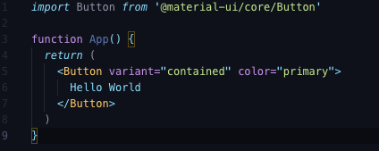
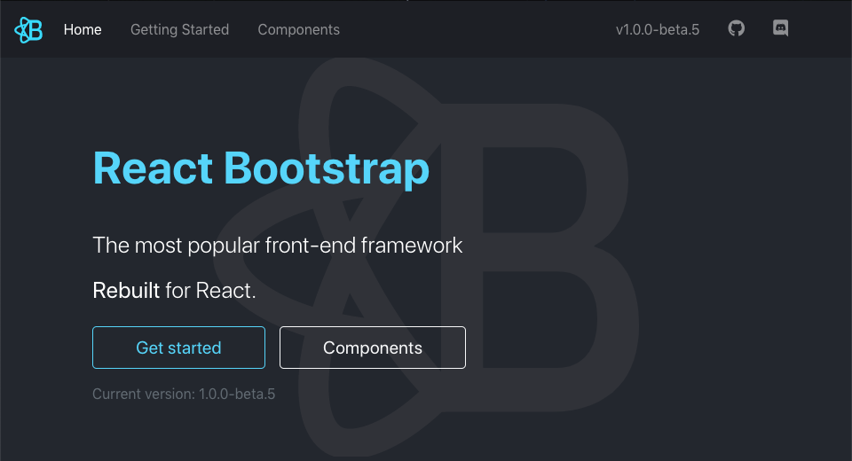
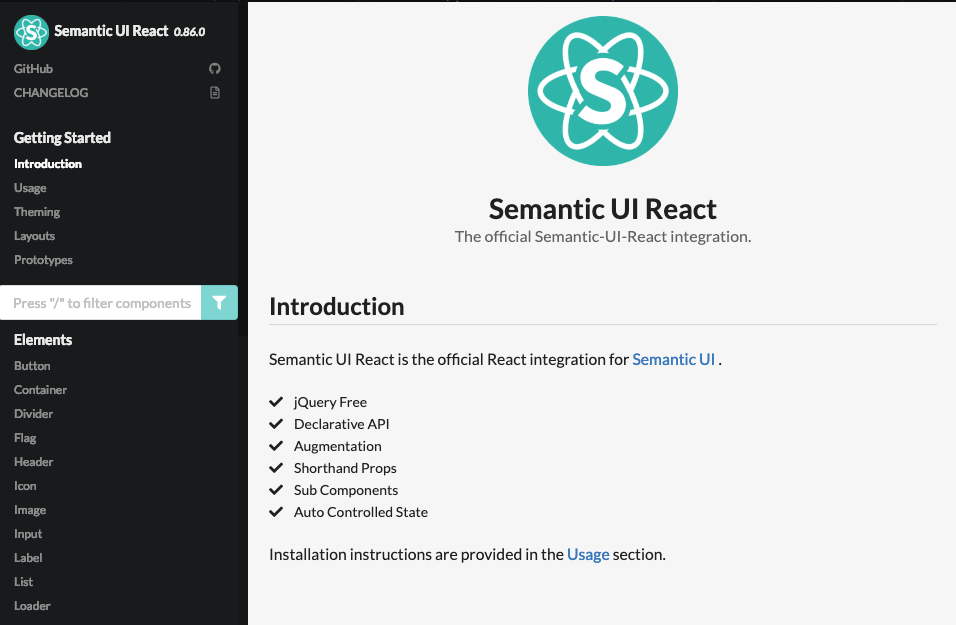
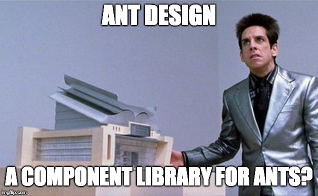
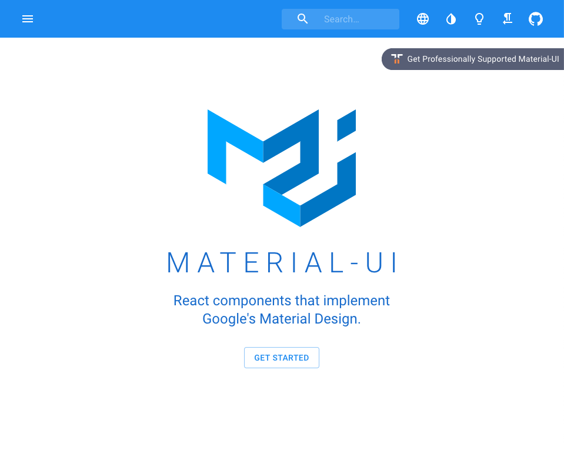

### How is a React UI component different?

React frameworks take advantage of React’s JSX tags and call a loaded component from the associated library. These frameworks implement CSS practices as components which make development easier and Can make your code more readable.

### Most Popular UI Frameworks

#### [React-Bootstrap](https://react-bootstrap.github.io/)

This project implements Bootstrap v4 and has all of its components supporting JSX tags. There are roughly 30+ Bootstrap components and it currently has 240 contributors and almost 15k stars and is maintained regularly by the community.

---

#### [Semantic-UI-React](https://react.semantic-ui.com/introduction)

This implements Semantic styling and allows for more customization and theming and offers barebones layouts and pages. It currently has 244 contributors and 9k stars and is mostly maintained by the team TechnologyAdvice.

---

#### [Ant Design](https://ant.design/)

More than just a React library or framework, its a massive ecosystem with a proprietary style guide. This library was created by Alibaba and has the most extensive library for React. Possible downsides to this may be the minimalistic design, may slow down load times and some documentation may be in Chinese but most was translated. This library has over 50 components and on Github has 774 contributors and over 43k stars.

---

#### [Material-UI](https://material-ui.com/)

Material-UI is inspired from Google’s Material design, it is open source and can be pictured as mostly mobile focused. This styling has decent support for theming and customization and uses CSS-in-JS for styling. A positive note is that this UI style is familiar to millions of users and is open source but on the other hand many people do not like how unoriginal it looks. This library has more than 30 components and is the most popular component library on Github with 1,158 contributors and over 45k stars.

